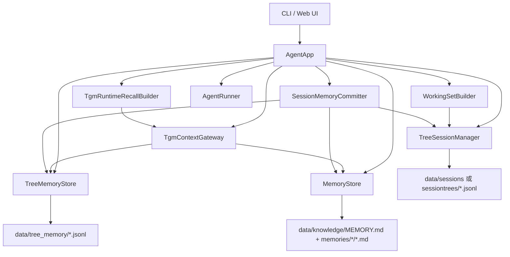

# PrismX 当前实现架构文档

本文描述的是 `D:\agent架构比赛\my_agent2` 当前代码的真实实现，而不是 `docs/TGM.md` 中的愿景版架构。

核心判断：

- 当前包名和主源码路径是 `src/prismx`，不是旧文档或旧计划里出现的 `src/my_agent2`。
- 当前系统已经形成可运行的 TGM 主链路：`TreeSession -> Tree Memory -> Long-term Memory -> Runtime Recall -> Working Set -> LLM`。
- 当前长期知识主路径是 `MemoryStore` 管理的 Markdown 记忆文件；`WikiKnowledgeBase` 和 `LocalSemanticVectorIndex` 存在，但不是 `AgentApp` 的主要运行入口。
- 当前 Tree Memory 是树内横向共享层，不是完整聊天记录，也不是 MemoryGraph 图扩展层。

## 1. 总体运行结构



主装配入口是 `src/prismx/loop.py::AgentApp`。它负责初始化模型、工具、MCP、会话树、树内记忆、长期记忆、运行时召回和 Working Set。

真实模块分工如下：

| 模块 | 当前责任 | 不负责 |
|---|---|---|
| `AgentApp` | 应用级编排、初始化依赖、处理一轮用户输入、注册工具、触发 compact | 不保存原始对话事实 |
| `TreeSessionManager` | append-only 树形会话、active leaf、active branch、分支跳转、分支摘要、压缩、模型消息构建 | 不做树内横向共享和长期知识检索 |
| `TreeMemoryStore` | 当前 tree 内的可复用经验、决策、约束、todo、事实等 | 不保存完整对话，不跨 tree 共享 |
| `TgmContextGateway` | 统一封装 Tree Memory 和 Long-term Memory 的 remember/search/read/list | 不拥有独立存储 |
| `TgmRuntimeRecallBuilder` | 构建三层 Runtime Recall 文本 | 不直接构建 raw active branch messages |
| `WorkingSetBuilder` | 汇总 active branch、任务状态、最近工具结果、episode summary、runtime recall | 不写入长期记忆 |
| `MemoryStore` | 长期 Markdown 记忆、用户画像、token 日志、记忆搜索、tree memory 晋升落盘 | 不再是原始会话事实源 |
| `SessionMemoryCommitter` | compact 后把会话摘要和稳定 Tree Memory 提交到长期记忆 | 不决定 active path |

## 2. 一轮对话的真实数据流

普通用户输入走 `AgentApp.ask()`：

```text
user_input
-> TreeSessionManager.append_message()
-> TreeSessionManager.debugBuildModelContext()
-> TgmRuntimeRecallBuilder.build()
-> WorkingSetBuilder.build()
-> ContextBuilder.build(runtime_context=WorkingSet.render())
-> TreeSessionManager.buildModelContext()
-> AgentRunner.step()
-> on_tool_call / on_tool_result / on_assistant_message 回写 TreeSession
-> 如 token 阈值触发 compact_now()
```

关键点：

- 用户消息先进入 TreeSession，成为树的一部分。
- Runtime Recall 的 Active Path 部分只记录路径摘要；raw active branch messages 仍由 `tree.buildModelContext()` 作为模型历史传入。
- Working Set 被渲染进 system prompt，模型历史则来自 active branch。
- 工具调用和工具结果会在 runner 回调中追加到同一棵 TreeSession。
- 如果 token 使用达到阈值，会尝试执行 `compact_now()`，再由 `SessionMemoryCommitter` 写长期记忆。

## 3. TreeSession：真实树形结构实现

实现文件：`src/prismx/tree_session.py`

核心类：

- `TreeSessionManager`
- `TreeSession`
- `SessionEntry` 及其子类
- `JsonlSessionStorage`

### 3.1 数据模型

TreeSession 的节点不是一个抽象 Session 对象，而是 append-only JSONL 里的 entry。每个 tree entry 都有：

- `id`
- `sessionId`
- `parentId`
- `timestamp`
- `type`
- `metadata`

主要 entry 类型：

| Entry 类型 | 用途 | 是否通常进入模型上下文 |
|---|---|---|
| `session_info` | 会话元数据 | 否 |
| `session_state` | active leaf 状态变化 | 否 |
| `message` | user/assistant 消息 | 是 |
| `tool_call` | 工具调用记录 | 否 |
| `tool_result` | 工具结果 | 是 |
| `branch_summary` | 分支摘要 | 是 |
| `compaction` | 压缩摘要 | 是 |
| `label` | 标签 | 否 |
| `context_layer` | 上下文层级标注 | 否 |
| `raw` | 原始大文件或日志引用 | 否 |
| `custom` | 自定义事件，如 knowledge commit | 否 |

### 3.2 active path 机制

`getBranch(session_id, leaf_id=None)` 从当前 active leaf 沿 `parentId` 回溯到 root，再反转为 root 到 leaf 的顺序。

`buildModelContext(session_id)` 只把 active branch 上允许进入上下文的 entry 转成模型 messages。

这意味着：

```text
root
├─ branch A
└─ branch B  <- active leaf
```

当 active leaf 在 branch B 上时：

- branch B 路径上的消息进入模型上下文。
- branch A 的原始消息不会进入模型上下文。
- branch A 的可复用发现若写入 Tree Memory，可以通过 Runtime Recall 被 branch B 检索到。

### 3.3 分支操作

当前支持：

- `jumpToEntry(session_id, entry_id)`：把 active leaf 切到已有 entry。
- `forkFromEntry(session_id, entry_id)`：本质上也是把 active leaf 切到某个 entry，下一条 append 会自然形成新分支。
- `cloneActiveBranch(session_id)`：复制 active branch 到新 session。
- `addLabel(session_id, entry_id, label)`：给节点加标签。
- `render_tree(session_id)`：渲染树结构。

### 3.4 上下文压缩

`compactActiveBranch()` 会在当前 active branch 上生成 `CompactionEntry`。

压缩后的模型上下文构建逻辑是：

- 保留最新 compaction summary。
- 保留 compaction 后的新 entry。
- 根据 `firstKeptEntryId` 和 `compactedEntryIds` 控制哪些旧 entry 被摘要替代。
- 工具结果边界有保护逻辑，避免只保留 tool result 而丢掉对应 tool use 上下文。

## 4. Tree Memory：树内横向共享实现

实现文件：`src/prismx/tree_memory.py`

核心类：

- `TreeMemoryStore`
- `TreeMemoryItem`

Tree Memory 是项目级、tree-scoped 的短期共享经验池。它不保存完整聊天记录，只保存可复用的信息。

### 4.1 存储位置和 URI

当前主存储位置：

```text
data/tree_memory/{tree_id}.jsonl
```

兼容旧路径：

```text
memory/tree/{tree_id}.jsonl
```

URI 格式：

```text
tree://{tree_id}/memory/{item_id}
```

### 4.2 支持的记忆类型

当前 `TREE_MEMORY_TYPES` 包括：

- `conclusion`
- `decision`
- `constraint`
- `todo`
- `finding`
- `hypothesis`
- `discarded_option`
- `fact`

这些类型基本对应 `docs/TGM.md` 对 Tree Memory 的描述，但实现里多了 `fact`。

### 4.3 写入和去重

`TreeMemoryStore.remember()` 会：

1. 清理空内容。
2. 校验 memory type，不合法则降级为 `finding`。
3. 按 normalized content 查重。
4. 重复内容执行 upsert，合并 tags、提高 confidence、更新 source 信息。
5. 新内容创建 `TreeMemoryItem`。
6. 以 JSONL event 形式追加写入。

Tree Memory 是事件日志式存储，`items(tree_id)` 会 replay JSONL 得到当前状态。

### 4.4 检索和复用计数

`TreeMemoryStore.search()` 是轻量关键词检索，不是向量检索。

评分规则大致是：

- title 命中权重最高。
- tags 次之。
- type 次之。
- content 命中也计分。
- confidence 和 reuse_count 会提高排序。

被选中的记忆会调用 `mark_reused()` 增加 `reuse_count`。

### 4.5 晋升候选

`promotion_candidates(tree_id)` 当前条件是：

```text
status == active
and (confidence >= 0.85 or reuse_count >= 3)
```

注意：如果文档中写 `reuse_count >= 2`，那是过时描述；当前代码和测试按 3 次复用晋升。

## 5. Long-term Memory：长期记忆真实实现

实现文件：`src/prismx/memory.py`

核心类：

- `MemoryStore`
- `LongTermMemory`
- `TokenLog`

当前长期记忆主路径不是 `memory/Wiki/*`，而是：

```text
data/knowledge/
├─ MEMORY.md
└─ memories/
   ├─ user/
   ├─ feedback/
   ├─ project/
   └─ reference/
```

`MemoryStore` 初始化时会创建这些目录，并维护 `MEMORY.md` 索引。

### 5.1 长期记忆类型

长期记忆类型包括：

- `user`
- `feedback`
- `project`
- `reference`

分类映射由 `CATEGORY_TO_LONG_TERM_TYPE` 控制。例如：

| category | long-term type |
|---|---|
| `profile` | `user` |
| `preferences` | `feedback` |
| `decisions` | `project` |
| `constraints` | `project` |
| `research` | `reference` |

### 5.2 长期记忆写入

长期记忆主要有两种来源：

1. `TgmContextGateway.remember(..., scope="long_term")`
2. `SessionMemoryCommitter.commit_compaction()`

`MemoryStore.remember_note()` 要求必须有：

- `source_tree_id`
- `source_memory_id`

因此长期记忆不是随便写入的裸 note，而是尽量从 Tree Memory 或 session archive 中带来源。

### 5.3 Tree Memory 晋升

Tree Memory 晋升可以走两条路径：

- Runtime Recall 时，`TgmRuntimeRecallBuilder._promote_stable_tree_memory()` 自动检查稳定 Tree Memory 并调用 `MemoryStore.promote_tree_memory()`。
- compact 后，`SessionMemoryCommitter` 用 `KnowledgeCompiler.compile_tree_memory()` 生成 operations，再交给 `MemoryStore.commit_session_archive()`。

晋升后，Tree Memory item 会被标记为：

```text
status = promoted
promoted = true
```

## 6. Runtime Recall：三层召回真实实现

实现文件：`src/prismx/runtime_recall.py`

核心类：

- `TgmContextGateway`
- `TgmRuntimeRecallBuilder`

### 6.1 TgmContextGateway

`TgmContextGateway` 是 Tree Memory 和 Long-term Memory 的统一门面。

它提供：

- `remember()`
- `search()`
- `search_tree()`
- `search_long_term()`
- `read()`
- `list()`
- `neighbors()`

默认 `remember()` 行为：

```text
scope="tree" -> 写 Tree Memory
scope="long_term" 或特殊 memory_type -> 写 Tree Memory + Long-term Memory
```

特殊长期记忆类型：

- `user_profile`
- `user_feedback`
- `project_state`
- `reference`

这些会被映射到长期记忆 category。

### 6.2 TgmRuntimeRecallBuilder

`TgmRuntimeRecallBuilder.build()` 输出 Markdown 文本：

```text
## Runtime Recall

### Active Path Retrieval
...

### Tree Memory Retrieval
...

### Long-term Knowledge Retrieval
...
```

真实行为：

- Active Path 原始消息不在这里展开，只写路径摘要。
- Tree Memory 从当前 tree_id 检索。
- Long-term Memory 从 `MemoryStore.search_memory()` 检索。
- 长期记忆会按 session/project/status/sensitivity 做简单过滤和排序。
- 结果保存在 `last_results`，供 Working Set debug 使用。

## 7. Working Set：最终上下文包装

实现文件：`src/prismx/working_set.py`

核心类：

- `WorkingSet`
- `WorkingSetBuilder`

`WorkingSetBuilder.build()` 从 TreeSession 读取：

- active branch entry ids
- active branch context messages
- 最近的 tool result
- branch summary / compaction 作为 episode summaries

然后合并：

- 当前任务
- todo 状态
- runtime recall 文本
- recall results

`WorkingSet.render()` 的输出会被 `ContextBuilder.build()` 注入 system prompt。

真实模型输入由两部分组成：

```text
system prompt:
  templates/system.md
  + user profile
  + skills summary
  + WorkingSet.render()

messages:
  tree.buildModelContext(session_id)
```

这点很重要：Working Set 不是替代 active branch messages，而是补充 system prompt。

## 8. compact 与记忆提交链路

实现文件：

- `src/prismx/loop.py`
- `src/prismx/session_memory_committer.py`
- `src/prismx/knowledge_compiler.py`
- `src/prismx/memory.py`

真实流程：

```text
AgentApp.compact_now()
-> TreeSessionManager.compactActiveBranch()
-> SessionMemoryCommitter.commit_compaction()
-> LlmMemoryExtractor.extract()
-> TreeMemoryStore.promotion_candidates()
-> KnowledgeCompiler.compile_tree_memory()
-> MemoryStore.commit_session_archive()
-> TreeSessionManager.appendKnowledgeCommit()
```

提交内容有两类：

1. LLM 从 compaction summary 中抽取的长期记忆 operations。
2. 稳定 Tree Memory 编译出的长期知识 operations。

失败处理：

- `LlmMemoryExtractor.extract()` 失败时返回空 operations 和错误字符串。
- `AgentApp.compact_now()` 捕获 commit 失败并打印 warning，但仍可能返回 compact 成功。

这是一个真实风险：TreeSession 已 compact，但 memory commit 可能失败，需要后续加强事务性或补偿机制。

## 9. 工具层和 UI 暴露

上下文工具实现文件：`src/prismx/tools/context.py`

注册位置：`AgentApp._build_registry()`

当前工具：

- `search_context`
- `read_context`
- `list_context`
- `show_context_links`

工具真实行为：

| 工具 | 行为 |
|---|---|
| `search_context` | 如果后端是 `TgmContextGateway`，同时搜 Tree Memory 和 Long-term Memory |
| `read_context` | `tree://` 读 Tree Memory，`mem://` 读长期记忆 |
| `list_context` | 默认列当前 Tree Memory；`prefix="mem://"` 列长期记忆 |
| `show_context_links` | Tree Memory 当前无 links；长期记忆依赖 memory store 的 graph_neighbors，但当前主实现返回空 |

Web 侧相关实现：

- `src/prismx/server.py` 会把 tree memory items 放到 workspace payload。
- `frontend` 展示树、工作区、工具、记忆等状态，但 Tree Memory 的主要使用入口仍是 context tools 和 Working Set。

## 10. 当前实现与 TGM.md 的一致性

| TGM.md 概念 | 当前实现状态 | 说明 |
|---|---|---|
| TreeSession | 已实现 | `TreeSessionManager` append-only JSONL，active leaf / active branch |
| Active Path Context | 已实现 | `buildModelContext()` 只取 active branch |
| Tree Memory | 已实现 | `TreeMemoryStore`，tree-scoped JSONL |
| 横向经验共享 | 已实现 | sibling branch 原始消息不共享，但可召回 Tree Memory |
| Long-term Knowledge | 部分实现 | `MemoryStore` Markdown 长期记忆为主；Wiki/semantic index 类存在但非主路径 |
| 记忆晋升机制 | 已实现轻量版 | confidence >= 0.85 或 reuse_count >= 3 |
| Runtime Recall 三层 | 已实现 | `TgmRuntimeRecallBuilder` 输出三层文本 |
| Working Context | 已实现轻量版 | `WorkingSet.render()` 注入 system prompt |
| Semantic Vector Index | 未按文档完全实现 | 当前主搜索是关键词/轻量 token overlap，不是真向量 |
| MemoryGraph 横向扩展 | 未作为主路径实现 | Tree Memory links 当前为空 |

## 11. 当前代码的真实边界

### 已经比较扎实的部分

- TreeSession 是原始对话事实源。
- active branch 不污染 sibling branch。
- Tree Memory 能解决树内横向共享。
- `remember` 默认写 Tree Memory，长期保存需要显式 scope 或特殊类型。
- Runtime Recall 和 Working Set 已接入 `AgentApp.ask()`。
- compact 后可提交长期记忆。

### 轻量或未完成的部分

- 长期知识不是完整 Wiki + 真向量检索系统。
- MemoryGraph 没有接入 Tree Memory 的召回扩展。
- Branch-safe recall 主要是排序策略，不是完整权限/污染控制引擎。
- compact 和 memory commit 之间没有强事务。
- `AgentApp.close()` 只关闭 MCP，其他资源没有完整生命周期管理。
- 文档中部分旧路径、旧包名、旧晋升阈值需要清理。

## 12. 如果继续演进，建议的负责人决策

如果我是总负责人，我不会先重写架构，而会按以下顺序推进：

1. 先把文档统一到当前 `src/prismx` 实现，删除或标注旧的 `src/my_agent2` 路径。
2. 固化 TreeSession + Tree Memory + Runtime Recall 这条主链路，因为它已经有测试支撑。
3. 把长期知识层的目标重新定清楚：要么承认当前 `MemoryStore` Markdown 是主路径，要么正式把 `WikiKnowledgeBase` 和 semantic index 接入 `AgentApp`。
4. 加强 compact -> memory commit 的一致性，避免压缩成功但长期记忆提交失败后无补偿。
5. 如果要强调 TGM 竞争力，再做 Tree Memory links / MemoryGraph / branch-safe recall，而不是继续堆抽象名词。

这个取舍的理由是：当前系统最有价值、也最接近可交付的是树形会话和树内记忆共享。长期知识和图谱层还有设计空间，但不应该反过来干扰已经工作的主链路。

## 13. 相关测试

当前能证明 TGM 主链路的测试主要包括：

- `tests/test_tree_session.py`
- `tests/test_tgm_refactor.py`
- `tests/test_prismax_tgm.py`
- `tests/test_session_memory_committer.py`
- `tests/test_context_tools.py`
- `tests/test_server_workspace_context.py`

其中关键覆盖：

- reload 后恢复 active leaf、labels、branch summary、compaction。
- sibling branch 不共享原始消息。
- sibling branch 可以召回 Tree Memory。
- `remember` 默认写 Tree Memory。
- 特殊长期记忆类型会 dual write。
- Runtime Recall 输出三层。
- Tree Memory 三次复用后晋升长期记忆。
- compaction commit 可写长期记忆文件并回写 knowledge commit event。

